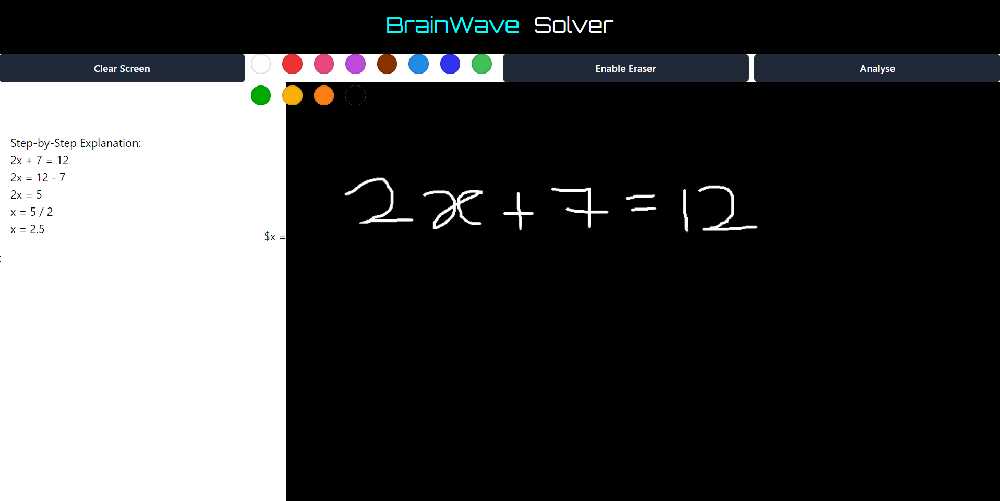

---

# BrainWave - Solver (Beta Version) 🧠🖊️

Welcome to **BrainWave - Solver**, where doodles meet detailed math explanations! This project takes your canvas drawings and not only solves the equations, but now walks you through the solution *step-by-step* like a math teacher who’s had just the right amount of coffee. Ready to solve equations with the flick of your wrist (or mouse)? Let’s get started!

## Table of Contents

- [Introduction](#introduction)
- [Demo](#demo)
- [Features](#features)
- [Installation](#installation)
- [Usage](#usage)
- [Contributing](#contributing)
- [License](#license)

## Introduction

**BrainWave - Solver** is a web-based canvas drawing app where you can channel your inner mathematician by sketching symbols, expressions, or just some questionable math doodles. This project uses its power to recognize and solve these drawings – but wait, it gets even better! The latest version of **BrainWave - Solver** doesn't just throw the answer at you; it gives you a full explanation of how it got there. Say goodbye to "the answer is 42" and hello to “Here’s *why* the answer is 42.”

> "It’s not just math – it’s a *journey* of mathematical enlightenment." 

## Demo

Check out how **BrainWave - Solver** solves and explains equations:



## Features

- 🖌️ **Canvas Drawing**: Start with a blank slate and sketch your equations like the mathematical artist you are.
- ✏️ **Color Palette**: Why limit math to black-and-white? Switch colors and make your math *pop*.
- ✂️ **Eraser**: We get it, nobody’s perfect. Clean up any mistakes and start fresh with the eraser tool.
- 💡 **Equation Analysis**: Automatically analyzes your drawings and provides clean LaTeX output for professional math representation.
- 📜 **Step-by-Step Explanation**: The solver now takes you through the *how* and *why* of the solution, not just the final answer. Because we believe in teaching, not just telling.
- 🚀 **Clear and Analyze**: Easily reset the canvas and let the solver work its magic again and again.
- 🧮 **LaTeX Support**: You get that professional math output in real-time, ensuring your equations not only solve correctly but *look* right too.

## Installation

Ready to dive in and draw up some answers? Follow these steps to set up **BrainWave - Solver**:

1. **Clone this repository**:
   ```bash
   git clone https://github.com/yourusername/BrainWave-Solver.git
   cd BrainWave-Solver
   ```

2. **Install the dependencies**:
   ```bash
   npm install
   ```

3. **Start the development server**:
   ```bash
   npm run dev
   ```

4. **Open the app**: Open your browser and go to `http://localhost:3000`.

You're all set to start drawing, solving, and learning from those explanations!

## Usage

1. **Draw on the canvas**: Whether it's a quadratic equation or a mystery symbol (we’ve seen it all), just start drawing.
2. **Pick a color**: Want to express your mood with colors while solving equations? Go for it.
3. **Enable Eraser**: Accidentally wrote "π" instead of "∞"? Easily fix it with the eraser.
4. **Analyze**: Hit the analyze button, and the solver will not only give you the solution but also break down each step, making sure you understand the whole process.

### Pro Tips:
- Test out the solver with complex equations – you might just be amazed by the detailed breakdown.
- And if your drawings lean more abstract than algebraic, don't worry. **BrainWave - Solver** does its best to interpret your creative genius.

## Contributing

Want to help make this solver even *smarter*? Contributions are always welcome! Whether it’s improving the explanations, adding new features, or just giving the UI some extra polish – we’d love your input.

1. Fork the repo
2. Create your feature branch:
   ```bash
   git checkout -b feature/my-feature
   ```
3. Commit your changes:
   ```bash
   git commit -m 'Add some feature'
   ```
4. Push to the branch:
   ```bash
   git push origin feature/my-feature
   ```
5. Open a pull request!

> **Fun Fact**: Each contribution makes this solver a little bit smarter. Who knows, maybe someday it’ll start cracking jokes with its explanations.

## License

Distributed under the Rakesh@Bug License.

---

So grab your stylus, mouse, or even a touchpad if you’re brave enough, and turn your brainwaves into beautiful solutions – complete with explanations. After all, math should be as fun to *understand* as it is to solve!

